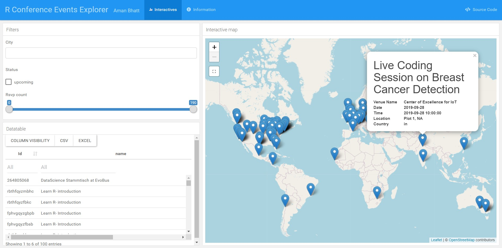

# R-Conference-Events-Explorer
‘R conference event explorer’ is a tool that provides a centralized place to find the events
happening around the world. With most events going virtual these days, having a central
tool to track them all would be potentially useful to groups, organizations, individuals in
terms of planning and avoiding coincidence.

## App screenshot:

  

 
 Demo App Link: https://bhattcodes.github.io/R-Conference-Events-Explorer/ds.html (deployed on github pages)
